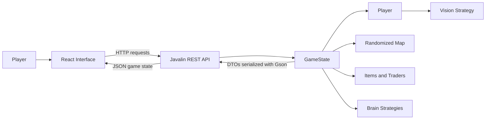

# Wilderness Survival System

A full-stack, turn-based survival game developed collaboratively by **CS3560 Team 4**. The application combines a React single-page interface with a Java/Javalin REST API that owns the game state, processes player actions, generates randomized terrain, applies survival mechanics, and returns structured JSON updates to the browser.

The objective is to manage limited resources, navigate a partially visible wilderness map, interact with items and traders, and reach the goal tile without exhausting the player's health, water, or energy.

## Project Highlights

- Full-stack client/server architecture with a React frontend and Java REST backend
- Server-authoritative game state and movement processing
- Procedurally generated 11 × 11 terrain maps
- Health, water, energy, gold, scoring, and level progression systems
- Multiple terrain types with different movement and resource effects
- Item pickups and trader encounters
- Configurable player vision strategies
- Three movement recommendation strategies with optional auto-play
- Keyboard and on-screen movement controls
- State-driven welcome, guide, trading, strategy, victory, and game-over interfaces
- JSON DTOs that separate backend domain objects from frontend response models

## Team Context and Individual Contribution

This repository was created as a collaborative software engineering course project. The team divided work across the user interface, game domain model, algorithms, server endpoints, and frontend/backend integration.

**Dale Peligro's primary contributions included:**

- Implementing nearly the entire React frontend
- Building the map interface, movement controls, status displays, menus, and modal workflows
- Managing client-side state, keyboard input, asynchronous requests, and server-response synchronization
- Integrating movement, game reset, level progression, trading, vision, strategy-hint, and auto-play functionality
- Contributing to Java/Javalin REST endpoints and JSON response structures

The repository's Git history preserves the individual contributions made by each team member.

## Technology Stack

| Layer | Technologies |
| --- | --- |
| Frontend | React 19, JavaScript, Vite 7, Tailwind CSS, CSS |
| Backend | Java 21, Javalin 5.6.3 |
| Serialization | Gson 2.10.1 |
| Build tooling | npm, Maven Wrapper |
| Test tooling | JUnit 5 |
| Collaboration | Git, GitHub |

Node.js is used for the frontend development and build toolchain. The application backend is implemented in Java.

## Architecture



The backend is the source of truth. The frontend sends player intentions, such as moving or accepting a trade, and then renders the updated state returned by the server.

## Core Game Loop

1. The frontend requests the current state from `GET /state`.
2. The player moves with WASD, the arrow keys, or the on-screen controls.
3. The frontend sends the requested direction to `POST /move`.
4. The backend:
   - moves the player;
   - applies terrain and resource effects;
   - updates the map;
   - processes item or trader encounters;
   - recalculates score and visible tiles;
   - checks victory and survival conditions.
5. The backend returns the updated board, player statistics, vision data, score, level, and active encounter.
6. React updates the interface and opens the appropriate modal when a trade, victory, or game-over condition occurs.

## Gameplay Systems

### Terrain and Map Generation

Each game starts with a randomized 11 × 11 map. The backend constructs a two-dimensional array of `Terrain` objects and randomly places the following terrain types:

- Standard terrain
- Desert
- Swamp
- Frost
- Mountain
- DMV
- Goal tile

The goal is placed away from the player's starting area. The map also receives randomized item and trader placements.

### Player Resources

The player tracks:

- Health
- Water
- Energy
- Gold
- Current position
- Previous position
- Current vision behavior
- Consumed-item statistics
- Win and trading state

Movement affects resources according to the underlying terrain. The game checks player resources after every move and uses them to determine whether the player remains alive.

### Items

Randomly spawned items can immediately affect the player's resources:

- Water Bottle
- Medicine
- Energy Drink
- Turkey

Item consumption also contributes to the scoring system.

### Traders

Trader encounters generate offers based on trader properties and player state. Traders can vary by:

- Name
- Trader type
- Mood
- Patience

The player may accept or reject the current offer. Accepting deducts gold and applies the offered item's effect; rejecting closes the interaction and updates the trader encounter.

### Vision Strategies

The visible portion of the map is controlled by a replaceable vision strategy. The API exposes multiple options:

- Cautious Vision
- Keen Vision
- Narrow Vision
- Queen Vision

Changing the vision strategy causes the frontend to request a refreshed game state and redraw the visible map tiles.

### Brain Strategies

The backend provides three movement recommendation strategies:

- **Balanced Brain** — balances survival and progression
- **Explorer Brain** — favors exploration
- **Greedy Brain** — favors reward-oriented movement

A strategy request returns a recommended move based on the current game state and visible tiles. The frontend can display a single hint or repeatedly execute recommendations through auto-play.

### Scoring and Progression

The score incorporates:

- Current level
- Gold
- Energy drinks consumed
- Turkey consumed
- Medicine consumed
- Water bottles consumed

Reaching the goal opens the victory interface and allows the player to continue to a newly generated level. Resetting the game returns the player to level one while preserving the high-score calculation performed by the backend.

## Frontend

The frontend is a React single-page application built with Vite. `App.jsx` acts as the primary orchestration layer for game state, API communication, keyboard input, modal state, and auto-play behavior.

### Frontend Responsibilities

- Fetching the initial server state
- Sending movement requests
- Synchronizing player, map, score, level, trader, and vision data
- Handling WASD and arrow-key controls
- Disabling movement while blocking modals are open
- Managing game reset and next-level transitions
- Opening trader, strategy, guide, vision, victory, and death interfaces
- Displaying strategy hints and auto-play status
- Detecting win and game-over conditions from server responses

### Component Structure

| Component | Responsibility |
| --- | --- |
| `App.jsx` | Application state, API calls, event handling, and component composition |
| `Map.jsx` | Renders the terrain grid, visibility state, player, items, and traders |
| `GameControls.jsx` | Provides clickable directional movement controls |
| `StatsUI.jsx` | Displays player health, water, energy, and gold |
| `BrainUI.jsx` | Displays strategy options, loading state, and recommended moves |
| `TraderUI.jsx` | Presents trader details and accept/reject actions |
| `Legend.jsx` | Explains terrain, entities, and controls |
| `Modal.jsx` | Shared modal container used by game workflows |
| `WelcomeScreen.jsx` | Introduces the game and starts the session |
| `DeathScreen.jsx` | Handles the game-over flow |
| `WinScreen.jsx` | Handles level completion and progression |
| `InventoryUI.jsx` | Contains inventory-oriented presentation code for future integration |

### Frontend Data Flow

```text
User input
   ↓
React event handler
   ↓
fetch() request to the configured API base URL
   ↓
Java game-state mutation
   ↓
JSON response
   ↓
React state update
   ↓
Map, statistics, menus, and modals re-render
```

### Controls

| Action | Input |
| --- | --- |
| Move up | `W` or `Arrow Up` |
| Move down | `S` or `Arrow Down` |
| Move left | `A` or `Arrow Left` |
| Move right | `D` or `Arrow Right` |
| Open guide | Guide button |
| Request a strategy hint | The Brain menu |
| Change visibility behavior | Set Vision menu |
| Start or stop automated movement | Auto-Play controls |
| Restart | Reset Game button |

## Backend

The backend is a Java 21 application built with Maven and exposed through Javalin. It stores one in-memory `GameState` instance and serializes API responses with Gson.

### Backend Responsibilities

- Owning the authoritative game state
- Generating maps, terrain, goals, items, and traders
- Validating and processing movement directions
- Applying player resource changes
- Detecting item, trader, win, and death events
- Calculating score and level progression
- Executing movement strategies
- Switching vision behavior
- Converting domain objects into frontend-safe DTOs
- Serving JSON responses over HTTP

### Important Backend Classes

| Class | Responsibility |
| --- | --- |
| `GameServer` | Configures Javalin, CORS, REST endpoints, Gson, and response DTOs |
| `GameState` | Coordinates the active map, player, level, score, encounters, and game transitions |
| `Map` | Generates and stores the terrain matrix and goal location |
| `Player` | Stores position, resources, gold, inventory-related statistics, and status |
| `Terrain` | Base terrain model with specialized terrain subclasses |
| `Item` / `ItemType` | Defines collectible resource effects |
| `Trader` / `TraderType` | Defines trader behavior and offer generation |
| `TradeOffer` | Represents an item offer and gold cost |
| `Vision` | Calculates visible map coordinates using selectable vision behavior |
| `Brain` | Defines the movement-strategy interface |
| `BalancedBrain` | Implements balanced movement recommendations |
| `ExplorerBrain` | Implements exploration-focused recommendations |
| `GreedyBrain` | Implements reward-focused recommendations |
| `Goal` | Represents the level-completion tile |
| `Move` / `Direction` | Represents movement decisions and directions |

## REST API

The backend runs at `http://127.0.0.1:8080` by default. Set `HOST` or `PORT` to
change its listener and `CORS_ALLOWED_ORIGINS` to a comma-separated list of
allowed frontend origins.

Game endpoints require an `X-Game-Session` header containing a UUID. The
frontend creates one in browser `sessionStorage`, so each visitor—and each tab—
gets an independent in-memory game. Inactive sessions expire after four hours.

### Game State

| Method | Endpoint | Description |
| --- | --- | --- |
| `GET` | `/state` | Returns the complete current game state |
| `POST` | `/move` | Moves the player and returns the updated state |
| `POST` | `/reset` | Resets the game to level one |
| `POST` | `/nextlevel` | Generates the next level and returns its initial state |

Movement request body:

```json
{
  "direction": "up"
}
```

Valid directions are `up`, `down`, `left`, and `right`.

### Strategy Endpoints

| Method | Endpoint | Description |
| --- | --- | --- |
| `POST` | `/balancedbrain` | Returns a balanced movement recommendation |
| `POST` | `/explorerbrain` | Returns an exploration-focused recommendation |
| `POST` | `/greedybrain` | Returns a reward-focused recommendation |

Example strategy response:

```json
{
  "brainMove": "MoveNorth",
  "visibleTiles": []
}
```

### Trading Endpoints

| Method | Endpoint | Description |
| --- | --- | --- |
| `POST` | `/begintrade` | Returns the active trader and generated offer |
| `POST` | `/accepttrade` | Pays the offer price and applies the item effect |
| `POST` | `/rejecttrade` | Rejects the current offer and closes the encounter |

### Vision Endpoints

| Method | Endpoint | Description |
| --- | --- | --- |
| `POST` | `/cautious-vision` | Activates cautious visibility behavior |
| `POST` | `/keen-vision` | Activates keen visibility behavior |
| `POST` | `/narrow-vision` | Activates narrow visibility behavior |
| `POST` | `/queen-vision` | Activates queen-style visibility behavior |

### State Response Shape

The state endpoints return a structure similar to:

```json
{
  "rows": 11,
  "cols": 11,
  "board": [
    [
      {
        "terrain": ".",
        "tileObject": null
      }
    ]
  ],
  "player": {
    "x": 0,
    "y": 0,
    "terrainStringBuffer": ".",
    "health": 100,
    "water": 100,
    "energy": 100,
    "gold": 0,
    "status": true,
    "won": false,
    "trading": false
  },
  "visibleTiles": [],
  "level": 1,
  "currentscore": 0,
  "highscore": 0,
  "activeTrader": null,
  "activeOffer": null
}
```

Board tiles may include an item or trader DTO in `tileObject`.

## Local Setup

### Prerequisites

Install:

- Java Development Kit 21
- Node.js and npm
- Git
- Bash on Linux/macOS or PowerShell on Windows

A separate Maven installation is not required because the backend includes the Maven Wrapper.

### Clone the Repository

```bash
git clone https://github.com/CS3560-Team-4/WSS-Project.git
cd WSS-Project
```

### Start the Backend

Linux or macOS:

```bash
cd backend
chmod +x run.sh
./run.sh
```

Windows PowerShell:

```powershell
cd backend
.\run.ps1
```

The backend listens on:

```text
http://localhost:8080
```

The backend can also be started directly through the Maven Wrapper:

```bash
cd backend
./mvnw compile exec:java
```

On Windows:

```powershell
cd backend
.\mvnw.cmd compile exec:java
```

### Start the Frontend

Open a second terminal:

```bash
cd frontend
npm install
npm run dev
```

Open the Vite address shown in the terminal, normally:

```text
http://localhost:5173
```

The backend allows the local Vite origin and the repository's GitHub Pages
origin by default. Override `CORS_ALLOWED_ORIGINS` when deploying from a fork or
another hostname.

## Production Deployment

The repository includes a GitHub Pages workflow, an executable backend jar,
and deployment templates for the existing `netricsports.us` Nginx server. See
[`deploy/README.md`](deploy/README.md) for the deployment and verification
commands.

## Development Commands

### Frontend

```bash
cd frontend

npm run dev       # Start the Vite development server
npm run build     # Create a production frontend build
npm run lint      # Run ESLint
npm run preview   # Preview the production build locally
```

### Backend

```bash
cd backend

./mvnw compile        # Compile the backend
./mvnw test           # Run configured tests
./mvnw package        # Build the Maven package
./mvnw exec:java      # Start GameServer
```

## Project Structure

```text
WSS-Project/
├── frontend/
│   ├── src/
│   │   ├── assets/             # Images and visual resources
│   │   ├── components/         # React UI components
│   │   ├── css/                # Application and global styles
│   │   ├── App.jsx             # Frontend orchestration and API integration
│   │   └── main.jsx            # React entry point
│   ├── index.html
│   ├── package.json
│   └── vite.config.js
│
├── backend/
│   ├── src/
│   │   ├── GameServer.java     # HTTP API and DTO mapping
│   │   ├── GameState.java      # Game coordinator
│   │   ├── Map.java            # Procedural map generation
│   │   ├── Player.java         # Player model and resources
│   │   ├── Terrain.java        # Base terrain behavior
│   │   ├── *Brain.java         # Strategy implementations
│   │   ├── Vision.java         # Visibility behavior
│   │   ├── Trader.java         # Trading behavior
│   │   └── Item.java           # Item effects
│   ├── pom.xml
│   ├── mvnw
│   ├── mvnw.cmd
│   ├── run.sh
│   └── run.ps1
│
└── README.md
```

## Engineering Decisions

### Server-Authoritative State

All important game mutations occur in the Java backend. The frontend sends commands rather than directly modifying health, resources, scoring, map contents, or trader outcomes. This keeps game rules centralized and prevents the interface from becoming a second implementation of the domain logic.

### Independent Browser Sessions

The frontend sends a random per-tab session ID with every API request. The
backend maps that ID to its own `GameState` and serializes concurrent requests
within the same game, while requests for different games can run independently.
Inactive sessions are removed automatically to bound memory usage.

### DTO-Based Responses

`GameServer` converts terrain, items, traders, offers, player statistics, and game metadata into dedicated JSON-friendly response objects. This prevents the frontend from depending directly on the backend's internal class structure.

### Strategy-Based Behavior

Movement recommendations and player visibility are modeled as replaceable behaviors. This allows the game to switch between different algorithms without changing the frontend contract or the core player interface.

### Componentized Interface

The React frontend separates map rendering, controls, statistics, guides, strategy selection, trading, and end-state workflows into focused components. `App.jsx` coordinates these components and manages their shared server state.

## Current Limitations and Future Improvements

This project was completed as an academic team project and currently uses a development-oriented architecture. Potential improvements include:

- Add persistent storage for users, scores, and saved games
- Preserve active games across backend restarts
- Expand request validation and API error responses
- Add broader automated frontend and backend test coverage
- Refactor API logic into a dedicated frontend service layer
- Split `App.jsx` state management into custom hooks or context providers
- Complete and integrate the inventory workflow
- Add authentication and multiplayer support
- Add continuous integration for linting, tests, and production builds
- Add screenshots or a recorded gameplay demonstration

## Academic Context

Wilderness Survival System was developed for **CS3560** as a collaborative team project. It demonstrates full-stack integration, object-oriented Java design, REST API development, React state management, algorithmic strategy implementations, and coordination across a shared Git repository.
